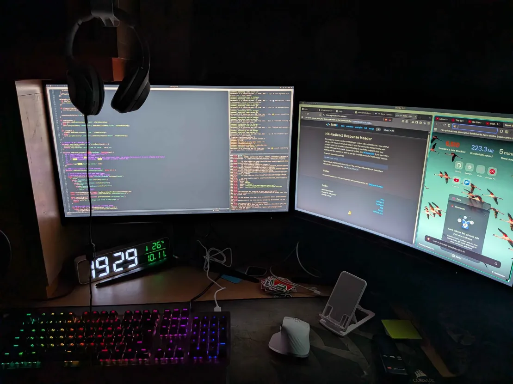

# 🐧 Ubarchy — Proving DHH Wrong!

> And then I realized I can't run hyprland on top of Ubunut, ... not a thing that runs on top of that, I need arch....” — DHH  
>  
> **Challenge accepted.**

Ubarchy is a modern Ubuntu-based environment with **Hyprland**, **Waybar**, and a full **Wayland** setup — blending the elegance of Ubuntu with the performance and aesthetics of tiling window managers.  

This project proves that you *can* have the best of both worlds — Ubuntu and Hyprland — in one cohesive setup.



---

🧠 Project Philosophy

Ubarchy is built around simplicity, performance, and control — aiming to provide a simple user experience, arch like aesthetics, and perfect for developer use.

Built in my free time before starting university.
Inspired by curiosity.
Driven by challenge.
Proving DHH wrong.

---

## 📦 Installation Options

Ubarchy offers two ways to get started:

1. **Install fresh using the Ubarchy ISO**
2. **Migrate your current Ubuntu machine to Ubarchy**

---

## 💿 Option 1 - Install from Ubarchy ISO

### The iso image can be found on the website 

## 🧭 Option 2 - Migrate Your Current System to Ubarchy

```bash
git clone https://github.com/tawfiqkhalilieh/ubrachy
cd ubrachy
```

## Install the packages
```bash
sudo ./install.sh
``` 

-# Now logout to leave the gnome enviroment, and login from hyprland

## Install the themes
```bash
sudo ./dots.sh
```

<details>
  <summary>Expand a step by step package installation</summary>
  

If you already have Ubuntu installed and just want to upgrade it into the full Ubarchy environment, follow these steps.

### 1. Install Hyprland and Base Packages

```bash
git clone -b 24.10 --depth=1 https://github.com/JaKooLit/Ubuntu-Hyprland.git ~/Ubuntu-Hyprland-24.10
cd ~/Ubuntu-Hyprland-24.10
chmod +x install.sh
./install.sh

sudo apt install swaybg nvim
```

### 2. Install Development and UI Dependencies
```bash
sudo apt install \
  clang-tidy \
  gobject-introspection \
  libdbusmenu-gtk3-dev \
  libevdev-dev \
  libfmt-dev \
  libgirepository1.0-dev \
  libgtk-3-dev \
  libgtkmm-3.0-dev \
  libinput-dev \
  libjsoncpp-dev \
  libmpdclient-dev \
  libnl-3-dev \
  libnl-genl-3-dev \
  libpulse-dev \
  libsigc++-2.0-dev \
  libspdlog-dev \
  libwayland-dev \
  scdoc \
  upower \
  libxkbregistry-dev
```

### 3. Install and Configure Waybar

```bash
git clone https://github.com/Alexays/Waybar
cd Waybar
meson setup build
ninja -C build
./build/waybar

# Optionally install system-wide
sudo ninja -C build install

mkdir -p ~/.config/waybar
```

### 4. Install Additional Utilities

## Code Editor and Browser
```bash
sudo apt update
sudo apt install wget gpg
wget -qO- https://packages.microsoft.com/keys/microsoft.asc | gpg --dearmor > packages.microsoft.gpg
sudo install -o root -g root -m 644 packages.microsoft.gpg /usr/share/keyrings/
sudo sh -c 'echo "deb [arch=$(dpkg --print-architecture) signed-by=/usr/share/keyrings/packages.microsoft.gpg] https://packages.microsoft.com/repos/code stable main" > /etc/apt/sources.list.d/vscode.list'
sudo apt update
sudo apt install code
sudo apt install curl -y
curl -fsS https://dl.brave.com/install.sh | sh
```

## Wayland Essentials
```
sudo apt install xdg-desktop-portal-wlr xwayland wl-clipboard grim slurp -y
```

## Wayland Essentials
```bash
sudo apt install btop alacritty -y
sudo update-alternatives --config x-terminal-emulator
```


## Discord Client
```bash
wget -O ~/discord.deb "https://discord.com/api/download?platform=linux&format=deb"
sudo apt install ~/discord.deb
sudo apt -f install
```

### After having all the packages ready, logout, and choose the hyprland environment to run

Once you’ve switched from GNOME to Hyprland, run these commands to configure your environment, themes, and aesthetics.

### 1. Configure `btop` Theme
```bash
mkdir -p ~/.config/btop/themes
curl -L -o ~/.config/btop/themes/btop.conf https://raw.githubusercontent.com/tawfiqkhalilieh/ubarchy/refs/heads/development/btop/themes/btop.conf
curl -L -o ~/.config/btop/themes/btop.theme https://raw.githubusercontent.com/tawfiqkhalilieh/ubarchy/refs/heads/development/btop/themes/btop.theme

```

### 2. Configure `alacritty`
```bash
mkdir -p ~/.config/alacritty/
rm -rf ~/.config/alacritty/*.yaml
curl -L -o ~/.config/alacritty/alacritty.yml https://raw.githubusercontent.com/tawfiqkhalilieh/ubarchy/refs/heads/development/alacritty/alacritty.toml
```

### 3. Download Background & Hyprland Configuration
```bash
curl -L -o ~/Downloads/a.png https://raw.githubusercontent.com/basecamp/omarchy/refs/heads/master/themes/everforest/backgrounds/1-everforest.jpg
curl -L -o ~/.config/hypr/hyprland.conf https://raw.githubusercontent.com/tawfiqkhalilieh/ubarchy/refs/heads/development/hypr/hyprland.conf
```

### 4. Setup Waybar Theme
```bash
curl -L -o ~/.config/waybar/config.jsonc https://raw.githubusercontent.com/tawfiqkhalilieh/ubarchy/refs/heads/development/waybar/config.jsonc
curl -L -o ~/.config/waybar/style.css https://raw.githubusercontent.com/tawfiqkhalilieh/ubarchy/refs/heads/development/waybar/style.css
```

This is the content of the collapsible section. You can include any Markdown-formatted text, lists, or code here.
</details>


## Note: NeoVim configration isn't added to the installtion scripts yet